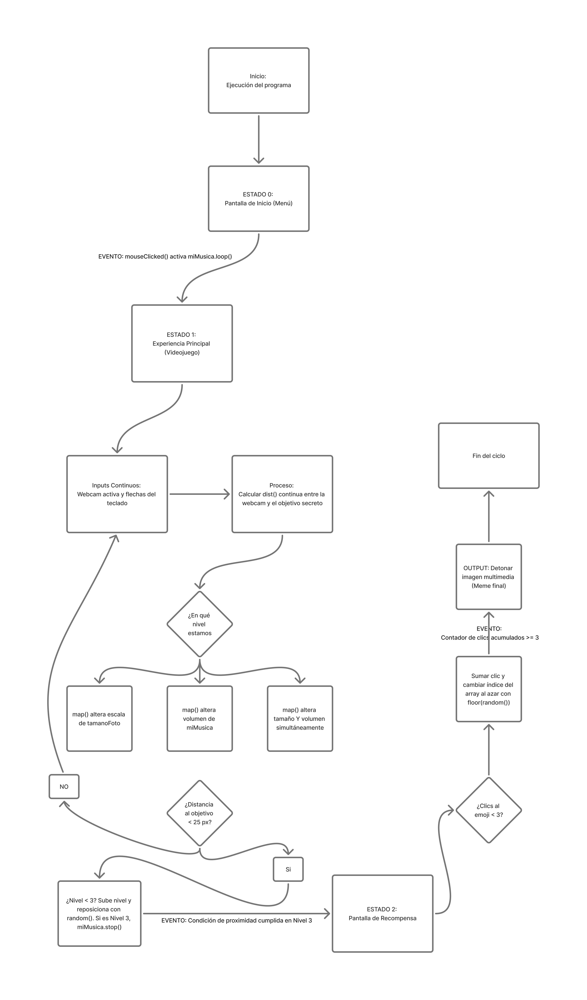

# Sistema Visual: Videojuego Bauhaus

* **Nombre del proyecto:** Bauhaus Adventure: Búsqueda Multimedia 
* **Autora:** Josefina Belén Zúñiga Cruz 
* **Curso:** Pensamiento Computacional 

## Descripción General
* **Descripción objetiva:** Sistema interactivo estructurado como un videojuego de tres niveles evolutivos desarrollado en p5.js
* **Elementos visuales:** Una interfaz con tramas constructivistas de fondo, donde la cámara web funciona como avatar, pasa tres niveles donde tendra que encontrar un punto secreto. Al final, se despliega una interfaz de recompensa con emojis y una tarjeta multimedia final.
* **Inputs utilizados:** Coordenadas espaciales continuas del cursor, eventos de clics del mouse y la señal de video nativa de la webcam.
* **Outputs generados:** Modulación continua del volumen de la música en tiempo real, transformaciones fluidas de escala de imagen y mutación de caracteres tipográficos.

## Descripción Conceptual
* **Idea central:** Crear un videojugo facil de utilizar donde el usuario experimenta la evolución de la forma, el espacio y el sonido.
* **Principio de diseño:** "La forma sigue a la interacción". El tamaño y el volumn sonoro cambia según la proximidad del personaje al objetivo secreto.

## Sistema Computacional
* **Inputs:** Coordenadas de posición del mouse (`mouseX`, `mouseY`), video en vivo (`createCapture`) y gatillos discretos del botón del mouse (`mouseClicked`).
* **Procesos:** Cálculo continuo de distancia (`dist()`), calculos lineal de rangos (`map()`), restricción de bordes (`constrain()`) y  índices aleatorios (`floor(random())`).
* **Estados:** Posee 3 estados de sistema que alteran las mecánicas del programa: Estado 0 (pantalla de inicio ), Estado 1 (videojuego con 3 niveles de dificultad de búsqueda) y Estado 2 (Pantalla final, recompensa).
* **Eventos:** Clic inicial para activar el audio, colisión por proximidad (`d < 25`) para avanzar de nivel o ganar, y clics acumulativos para abrir la recompensa.
* **Outputs:** Creacion en pantalla, cambio del volumen de audio y aparicion imagen del meme.

---

## Recursos Multimedia Utilizados
* **Tipo de recurso 1:** Audio  (`musica 30s.mp3`).
  * **Función en el sistema:** Actúa como un indicador en los niveles 2 y 3. Su volumen se intensifica mediante `map()` a medida que el jugador se aproxima al objetivo, guiando al usuario.
* **Tipo de recurso 2:** Captura de video en tiempo real (`createCapture`).
  * **Función en el sistema:** El avatr es un cuadro de video manejado por el usuario, cuyo tamaño cambia en el nivel 1 según la proximidad al objetivo.
* **Tipo de recurso 3:** Imagen externa (`meme.jpg`).
  * **Función en el sistema:** Actúa como "recompesa", revelándose únicamente cuando el contador de eventos del cofre se completa con éxito.

## Diagrama de Flujo
Aquí se presenta la arquitectura lógica completa del videojuego:

---

## Reflexión Final
* **Dificultades encontradas:** Lograr crear un sistema donde haya un objetivo oculto.
* **Aprendizajes obtenidos:** Aprender a realizar diferentes interfaces donde el usuario puede interactuar.

---

## Enlaces del Proyecto
* [Link público para ejecutar el proyecto en el navegador](https://editor.p5js.org/josefina.zuniga1/full/2Q-aS72pY)
* [Link editable para revisar el código en p5.js](https://editor.p5js.org/josefina.zuniga1/sketches/2Q-aS72pY)
